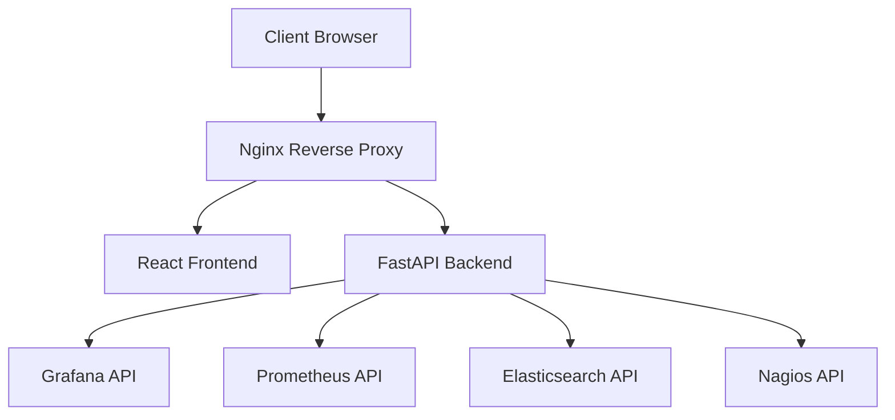

# Docker Deployment Guide

Complete guide for running the Incident Response Chatbot with Docker.

## Quick Start

```bash
# 1. Clone and setup
git clone <repository-url>
cd chatter

# 2. Run automated setup
./scripts/setup.sh
```

## Manual Setup

### 1. Environment Configuration

```bash
# Create environment file
cp .env.example .env

# Edit with your monitoring system details
nano .env
```

### 2. Choose Deployment Mode

#### Development Mode
- Live code reload
- Direct port access  
- Debug logging
- Hot module replacement

```bash
docker-compose up --build
```

#### Production Mode
- Nginx reverse proxy
- Health checks
- Resource limits
- Optimized builds
- JSON logging

```bash
docker-compose -f docker-compose.yml -f docker-compose.prod.yml up -d --build
```

## Docker Architecture



## Service Configuration

### Backend Service
- **Image**: Python 3.11 slim
- **Port**: 8000 (internal)
- **Health Check**: `GET /health`
- **Features**: 
  - Non-root user
  - Health monitoring
  - Environment-based config

### Frontend Service  
- **Image**: Node 18 Alpine
- **Port**: 3000 (internal)
- **Build**: Vite production build
- **Features**:
  - Multi-stage build
  - Static file serving
  - Non-root user

### Nginx Service
- **Image**: Nginx Alpine
- **Ports**: 80, 443
- **Features**:
  - Reverse proxy
  - SSL termination
  - Rate limiting
  - Security headers
  - Gzip compression

## Environment Variables

### Required Configuration

```bash
# Monitoring Systems
GRAFANA_URL=http://your-grafana:3000
GRAFANA_TOKEN=your-api-token
PROMETHEUS_URL=http://your-prometheus:9090
ELASTICSEARCH_URL=http://your-elasticsearch:9200
NAGIOS_URL=http://your-nagios/nagios

# Credentials
GRAFANA_USERNAME=admin
GRAFANA_PASSWORD=secret
ELASTICSEARCH_USERNAME=elastic
ELASTICSEARCH_PASSWORD=secret
NAGIOS_USERNAME=nagiosadmin
NAGIOS_PASSWORD=secret
```

### Optional Configuration

```bash
# Application
LOG_LEVEL=INFO
SECRET_KEY=your-secret-key

# SSL
SSL_CERT_PATH=/etc/nginx/ssl/cert.pem
SSL_KEY_PATH=/etc/nginx/ssl/key.pem

# Docker
COMPOSE_PROJECT_NAME=incident-response-chatbot
```

## SSL/HTTPS Setup

### Development (Self-signed)

```bash
# Generate self-signed certificates
openssl req -x509 -nodes -days 365 -newkey rsa:2048 \
  -keyout nginx/ssl/key.pem \
  -out nginx/ssl/cert.pem \
  -subj "/CN=localhost"
```

### Production (Real certificates)

```bash
# Copy your certificates
cp your-cert.pem nginx/ssl/cert.pem
cp your-key.pem nginx/ssl/key.pem

# Update nginx.conf with your domain
sed -i 's/your-domain.com/yourdomain.com/g' nginx/nginx.conf
```

## Operational Commands

### Starting Services

```bash
# Development
docker-compose up

# Production (detached)
docker-compose -f docker-compose.yml -f docker-compose.prod.yml up -d

# Rebuild containers
docker-compose up --build --force-recreate
```

### Monitoring

```bash
# View service status
docker-compose ps

# View logs
docker-compose logs -f

# View specific service logs
docker-compose logs -f backend

# Monitor resources
docker stats
```

### Scaling (Production)

```bash
# Scale backend instances
docker-compose -f docker-compose.yml -f docker-compose.prod.yml up -d --scale backend=3

# Scale frontend instances  
docker-compose -f docker-compose.yml -f docker-compose.prod.yml up -d --scale frontend=2
```

### Maintenance

```bash
# Stop services
docker-compose down

# Stop and remove volumes
docker-compose down -v

# Update containers
docker-compose pull
docker-compose up -d

# Clean up unused resources
docker system prune -f
```

## Health Checks

All services include health checks:

- **Backend**: `GET http://localhost:8000/health`
- **Frontend**: `GET http://localhost:3000`  
- **Nginx**: `GET http://localhost/health`

### Check Health Status

```bash
# All services
docker-compose ps

# Specific service
docker inspect --format='{{.State.Health.Status}}' chatbot_backend_1

# Manual health check
curl http://localhost/health
```

## Troubleshooting

### Common Issues

#### Services Not Starting
```bash
# Check logs
docker-compose logs

# Check service status
docker-compose ps

# Rebuild from scratch
docker-compose down -v
docker-compose up --build
```

#### Port Conflicts
```bash
# Check what's using ports
netstat -tulpn | grep :80
netstat -tulpn | grep :3000
netstat -tulpn | grep :8000

# Change ports in docker-compose.yml if needed
```

#### Permission Issues
```bash
# Fix volume permissions
sudo chown -R $USER:$USER ./backend ./frontend

# Rebuild containers
docker-compose up --build
```

#### SSL Certificate Issues
```bash
# Verify certificates
openssl x509 -in nginx/ssl/cert.pem -text -noout

# Regenerate if needed
rm nginx/ssl/*.pem
./scripts/setup.sh
```

### Performance Optimization

#### Resource Limits
```yaml
# Add to docker-compose.yml
deploy:
  resources:
    limits:
      cpus: '1.0'
      memory: 512M
    reservations:
      cpus: '0.5'
      memory: 256M
```

#### Log Management
```bash
# Limit log size
docker-compose down
docker system prune -f

# Configure log rotation in docker-compose.yml
logging:
  driver: "json-file"
  options:
    max-size: "10m"
    max-file: "3"
```

## Security Considerations

### Production Checklist
- [ ] Use real SSL certificates
- [ ] Set strong SECRET_KEY
- [ ] Configure firewall rules
- [ ] Enable log rotation
- [ ] Update default passwords
- [ ] Run security scan: `docker scan <image>`
- [ ] Regular container updates
- [ ] Monitor for vulnerabilities

### Network Security
```bash
# Create custom network
docker network create --driver bridge chatbot-secure

# Update docker-compose.yml to use custom network
networks:
  default:
    external:
      name: chatbot-secure
```

## Monitoring and Observability

### Container Metrics
```bash
# Enable metrics collection
echo '{"metrics-addr": "127.0.0.1:9323", "experimental": true}' | sudo tee /etc/docker/daemon.json

# Restart Docker
sudo systemctl restart docker

# Metrics endpoint
curl http://127.0.0.1:9323/metrics
```

### Log Aggregation
```yaml
# Add to docker-compose.yml for centralized logging
logging:
  driver: "fluentd"
  options:
    fluentd-address: "localhost:24224"
    tag: "chatbot.{{.Name}}"
```

## Backup and Recovery

### Data Backup
```bash
# Backup volumes
docker run --rm -v chatbot_nginx-logs:/data -v $(pwd):/backup ubuntu tar czf /backup/nginx-logs.tar.gz /data

# Backup environment
cp .env .env.backup
```

### Disaster Recovery
```bash
# Save container state
docker-compose ps > container-state.txt

# Export images
docker save -o chatbot-images.tar $(docker-compose config | grep image: | awk '{print $2}')

# Restore from backup
docker load -i chatbot-images.tar
docker-compose up -d
```