# Architecture Diagrams

## System Overview

## Request Flow Architecture

```mermaid
sequenceDiagram
    participant U as 👤 User
    participant F as 🎨 Frontend
    participant N as 🔀 Nginx
    participant A as 🚀 API
    participant L as 🤖 LLM Service
    participant M as 📊 Monitoring
    participant DB as 💾 Memory
    
    U->>F: Ask question
    F->>N: HTTP Request
    N->>A: Forward to API
    
    A->>DB: Store user message
    A->>M: Query monitoring data
    M-->>A: Return alerts/metrics
    
    A->>A: Analyze query complexity
    
    alt Complex Query (AI)
        A->>L: Generate AI response
        L->>L: Create incident context
        L-->>A: Intelligent analysis
    else Simple Query (Traditional)
        A->>A: Rule-based response
    end
    
    A->>DB: Store response
    A-->>N: Return response
    N-->>F: Forward response
    F-->>U: Display result
```

## LLM Integration Flow

```mermaid
flowchart TD
    Start([🚀 User Query]) --> Parse[📝 Parse Query]
    Parse --> Complex{🤔 Complex Query?}
    
    Complex -->|Yes| LLM_Available{🤖 LLM Available?}
    Complex -->|No| Traditional[📊 Traditional Response]
    
    LLM_Available -->|Yes| Context[📋 Create Context]
    LLM_Available -->|No| Traditional
    
    Context --> History[💭 Get Conversation History]
    History --> Provider{🔀 Choose Provider}
    
    Provider -->|Azure OpenAI| AzureGPT[🏢 Azure GPT-4 Analysis]
    Provider -->|OpenAI| GPT[🧠 GPT-4 Analysis]
    Provider -->|Anthropic| Claude[🎭 Claude Analysis]
    Provider -->|Fallback| Traditional
    
    AzureGPT --> Response[📤 AI Response]
    
    GPT --> Response[📤 AI Response]
    Claude --> Response
    Traditional --> Response
    
    Response --> Memory[💾 Save to Memory]
    Memory --> User([👤 Return to User])
    
    style Start fill:#e3f2fd
    style LLM_Available fill:#f3e5f5
    style Response fill:#e8f5e8
    style User fill:#fff3e0
```

## Docker Architecture

```mermaid
graph TB
    subgraph "🐳 Docker Environment"
        subgraph "🌐 Network: chatbot-network"
            N[🔀 Nginx Container<br/>:80, :443]
            F[⚛️ Frontend Container<br/>:3000]
            B[🚀 Backend Container<br/>:8000]
        end
        
        subgraph "📁 Volumes"
            V1[nginx-logs]
            V2[SSL Certificates]
        end
    end
    
    subgraph "🌍 External Services"
        LLM_EXT[🤖 LLM APIs<br/>Azure OpenAI/OpenAI/Anthropic]
        MON_EXT[📊 Monitoring<br/>Grafana/Prometheus/etc]
    end
    
    Client[💻 Client] --> N
    N --> F
    N --> B
    B --> LLM_EXT
    B --> MON_EXT
    
    N -.-> V1
    N -.-> V2
    
    style N fill:#ff9800,color:#fff
    style F fill:#2196f3,color:#fff
    style B fill:#4caf50,color:#fff
```

## File Structure Diagram

```mermaid
graph TD
    Root[📁 chatter/] --> Backend[📁 backend/]
    Root --> Frontend[📁 frontend/]
    Root --> Docker[📁 docker configs]
    Root --> Docs[📁 docs/]
    Root --> Scripts[📁 scripts/]
    Root --> Nginx[📁 nginx/]
    
    Backend --> MainPy[🐍 main.py<br/>FastAPI App]
    Backend --> LLMPy[🤖 llm_service.py<br/>AI Integration]
    Backend --> ConnDir[📁 connectors/]
    Backend --> ConfigPy[⚙️ config.py]
    Backend --> ReqTxt[📋 requirements.txt]
    Backend --> DockerfileB[🐳 Dockerfile]
    
    ConnDir --> BasePy[🔌 base.py<br/>Base Connector]
    ConnDir --> ElasticPy[🔍 elasticsearch.py<br/>ES Connector]
    
    Frontend --> SrcDir[📁 src/]
    Frontend --> PackageJson[📦 package.json]
    Frontend --> DockerfileF[🐳 Dockerfile]
    Frontend --> IndexHtml[📄 index.html]
    
    SrcDir --> AppTsx[⚛️ App.tsx<br/>Main Component]
    SrcDir --> MainTsx[🚀 main.tsx<br/>Entry Point]
    SrcDir --> IndexCss[🎨 index.css<br/>Styles]
    
    Docker --> ComposeYml[🐳 docker-compose.yml]
    Docker --> ComposeOverride[🔧 docker-compose.override.yml]
    Docker --> ComposeProd[🚀 docker-compose.prod.yml]
    Docker --> EnvExample[⚙️ .env.example]
    
    Nginx --> NginxConf[🔀 nginx.conf<br/>Reverse Proxy]
    Nginx --> SSL[🔒 ssl/<br/>Certificates]
    
    Scripts --> Setup[⚡ setup.sh<br/>Auto Setup]
    
    Docs --> Architecture[📊 architecture-diagrams.md]
    Docs --> DockerMd[🐳 DOCKER.md]
    
    Root --> ReadmeMd[📚 README.md]
    
    style Root fill:#e3f2fd
    style Backend fill:#4caf50,color:#fff
    style Frontend fill:#2196f3,color:#fff
    style LLMPy fill:#f3e5f5
```

## Data Flow Diagram

```mermaid
flowchart LR
    subgraph "📊 Monitoring Sources"
        G[📈 Grafana]
        P[📊 Prometheus]
        E[🔍 Elasticsearch]
        N[⚠️ Nagios]
    end
    
    subgraph "🔄 Processing Layer"
        C[🔌 Connectors]
        A[🔍 Analyzer]
        L[🤖 LLM Service]
    end
    
    subgraph "💾 Storage Layer"
        M[💭 Memory]
        H[📚 History]
    end
    
    subgraph "🎯 Output Layer"
        AI[🤖 AI Response]
        TR[📊 Traditional Response]
        S[💡 Suggestions]
    end
    
    G --> C
    P --> C
    E --> C
    N --> C
    
    C --> A
    A --> L
    
    L --> M
    M --> H
    
    L --> AI
    A --> TR
    AI --> S
    TR --> S
    
    style G fill:#ff9800
    style P fill:#e91e63
    style E fill:#3f51b5
    style N fill:#f44336
    style L fill:#9c27b0
    style AI fill:#4caf50
```

## Conversation Flow

## Component Architecture

```mermaid
graph TB
    subgraph "🎨 Frontend Components"
        App[📱 App.tsx<br/>Main Chat Interface]
        Chat[💬 Chat Component]
        Message[💌 Message Component]
        Input[⌨️ Input Component]
        Suggestions[💡 Suggestions Component]
    end
    
    subgraph "🚀 Backend Services"
        FastAPI[🔥 FastAPI Router]
        ChatEndpoint[💬 /chat endpoint]
        HealthEndpoint[❤️ /health endpoint]
        LLMService[🤖 LLM Service]
        IncidentAnalyzer[🔍 Incident Analyzer]
        Connectors[🔌 Monitoring Connectors]
    end
    
    subgraph "🤖 AI Layer"
        AzureClient[🏢 Azure OpenAI Client]
        OpenAIClient[🧠 OpenAI Client]
        AnthropicClient[🎭 Anthropic Client]
        PromptEngine[📝 Prompt Engine]
        TokenManager[🎫 Token Manager]
    end
    
    subgraph "💾 Data Layer"
        ConversationMemory[💭 Conversation Memory]
        IncidentContext[📋 Incident Context]
        MonitoringData[📊 Monitoring Data]
    end
    
    App --> Chat
    Chat --> Message
    Chat --> Input
    Chat --> Suggestions
    
    Chat --> FastAPI
    FastAPI --> ChatEndpoint
    FastAPI --> HealthEndpoint
    
    ChatEndpoint --> LLMService
    ChatEndpoint --> IncidentAnalyzer
    ChatEndpoint --> ConversationMemory
    
    LLMService --> AzureClient
    LLMService --> OpenAIClient
    LLMService --> AnthropicClient
    LLMService --> PromptEngine
    LLMService --> TokenManager
    
    IncidentAnalyzer --> Connectors
    Connectors --> MonitoringData
    
    LLMService --> IncidentContext
    IncidentContext --> MonitoringData
    
    style App fill:#2196f3,color:#fff
    style LLMService fill:#9c27b0,color:#fff
    style AzureClient fill:#0078d4,color:#fff
    style OpenAIClient fill:#00c853,color:#fff
    style AnthropicClient fill:#ff6d00,color:#fff
```

## Deployment Architecture

```mermaid
graph TB
    subgraph "🌐 Production Environment"
        LB[⚖️ Load Balancer<br/>nginx]
        
        subgraph "🔄 Application Tier"
            F1[⚛️ Frontend 1]
            F2[⚛️ Frontend 2]
            B1[🚀 Backend 1]
            B2[🚀 Backend 2]
            B3[🚀 Backend 3]
        end
        
        subgraph "📊 Monitoring Tier"
            G[📈 Grafana]
            P[📊 Prometheus]
            E[🔍 Elasticsearch]
            N[⚠️ Nagios]
        end
        
        subgraph "🤖 External AI Services"
            AzureOpenAI[🏢 Azure OpenAI]
            OpenAI[🧠 OpenAI API]
            Anthropic[🎭 Anthropic API]
        end
    end
    
    Users[👥 Users] --> LB
    LB --> F1
    LB --> F2
    LB --> B1
    LB --> B2
    LB --> B3
    
    B1 --> G
    B1 --> P
    B1 --> E
    B1 --> N
    B2 --> G
    B2 --> P
    B2 --> E
    B2 --> N
    B3 --> G
    B3 --> P
    B3 --> E
    B3 --> N
    
    B1 --> AzureOpenAI
    B1 --> OpenAI
    B1 --> Anthropic
    B2 --> AzureOpenAI
    B2 --> OpenAI
    B2 --> Anthropic
    B3 --> AzureOpenAI
    B3 --> OpenAI
    B3 --> Anthropic
    
    style LB fill:#ff9800,color:#fff
    style AzureOpenAI fill:#0078d4,color:#fff
    style OpenAI fill:#00c853,color:#fff
    style Anthropic fill:#ff6d00,color:#fff
```

