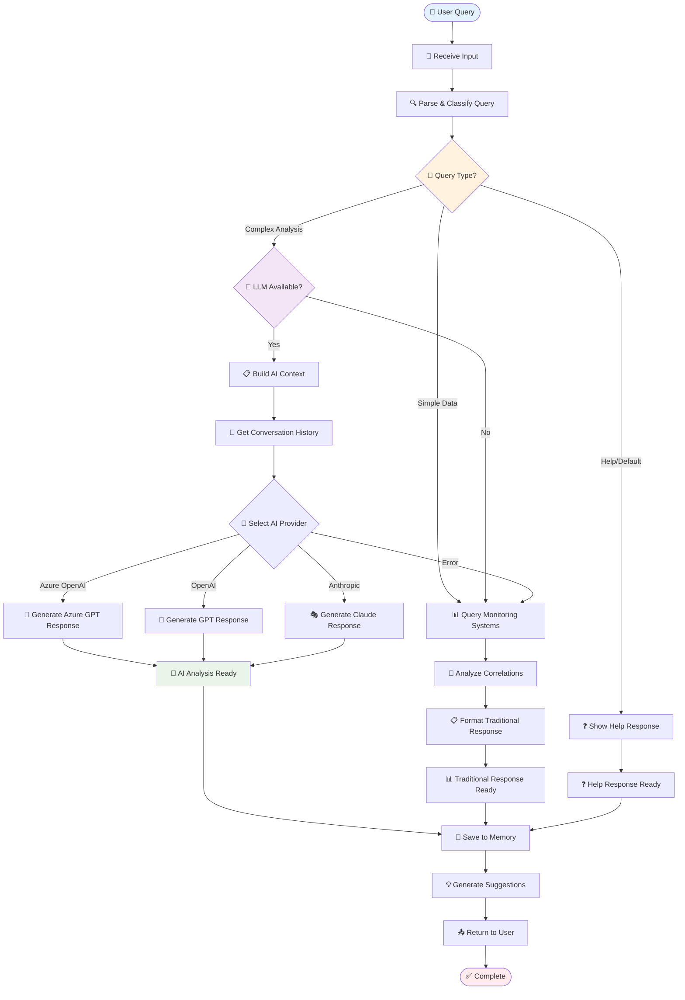
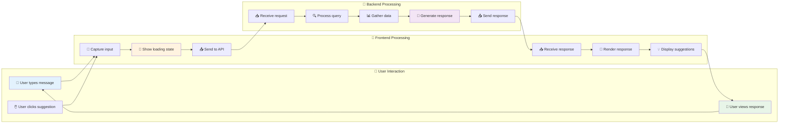
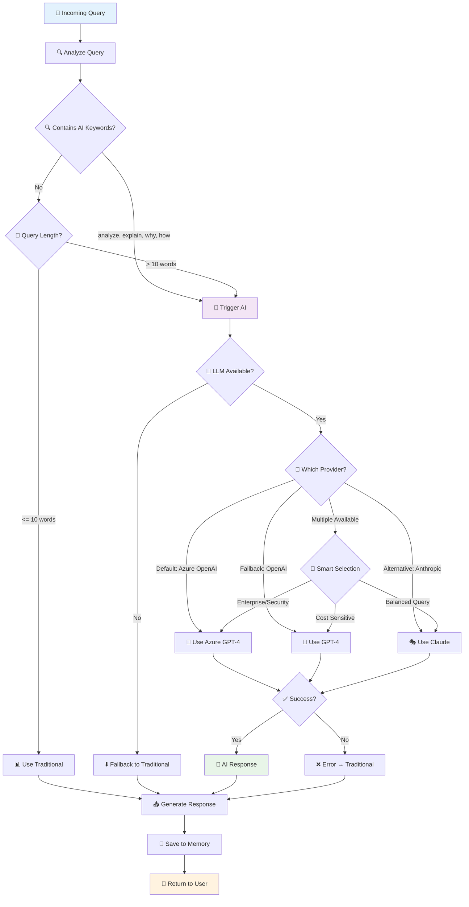
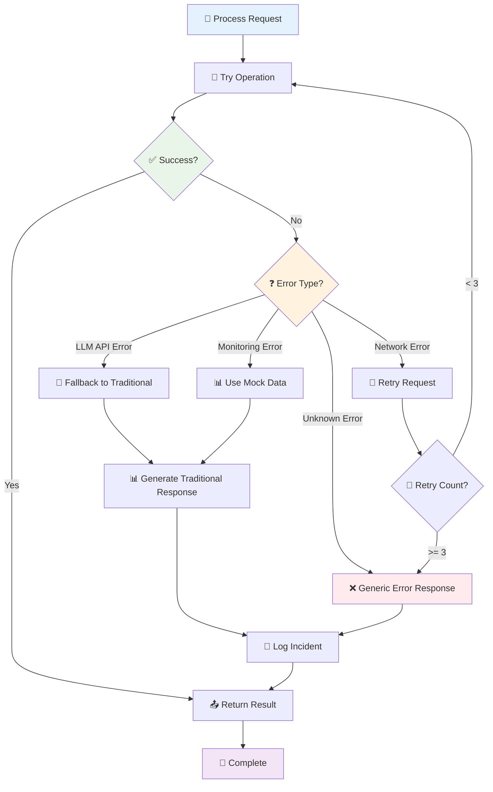
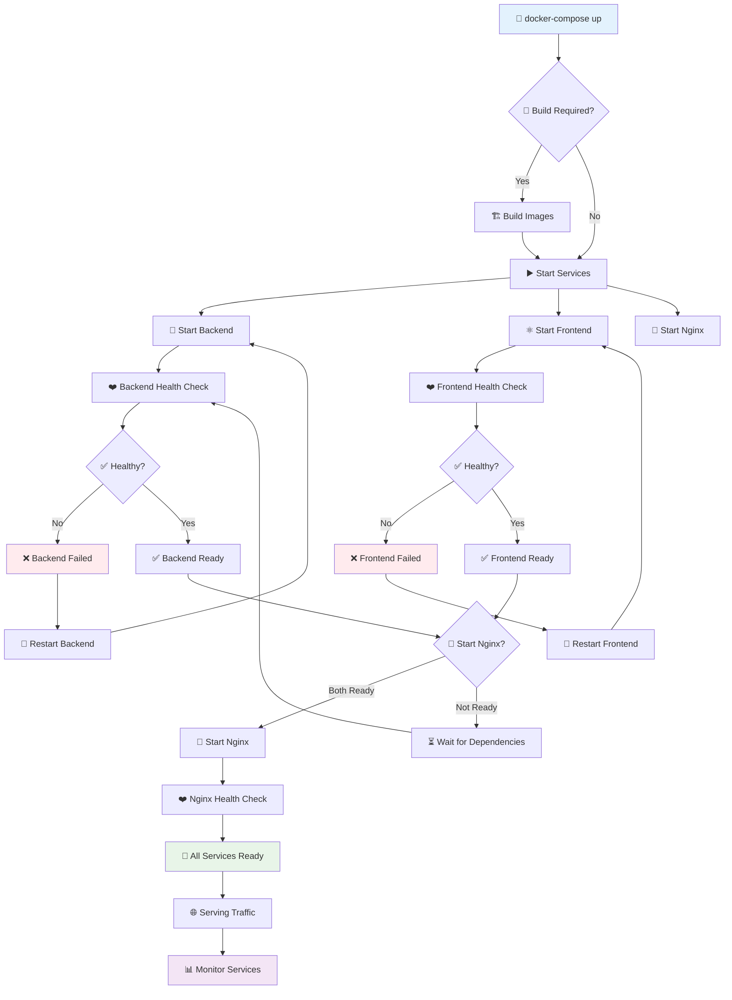
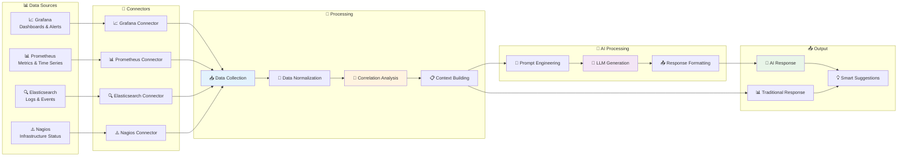

# System Flowcharts

## High-Level System Flow

```mermaid
flowchart TD
    Start([🚀 User Query]) --> Input[📝 Receive Input]
    Input --> Parse[🔍 Parse & Classify Query]
    
    Parse --> Decision{🤔 Query Type?}
    
    Decision -->|Simple Data| Monitor[📊 Query Monitoring Systems]
    Decision -->|Complex Analysis| LLM_Check{🤖 LLM Available?}
    Decision -->|Help/Default| Help[❓ Show Help Response]
    
    Monitor --> Correlate[🔗 Analyze Correlations]
    Correlate --> Format[📋 Format Traditional Response]
    
    LLM_Check -->|Yes| Context[📋 Build AI Context]
    LLM_Check -->|No| Monitor
    
    Context --> Memory[💭 Get Conversation History]
    Memory --> Provider{🔀 Select AI Provider}
    
    Provider -->|Azure OpenAI| AzureGPT[🏢 Generate Azure GPT Response]
    Provider -->|OpenAI| GPT[🧠 Generate GPT Response]
    Provider -->|Anthropic| Claude[🎭 Generate Claude Response]
    Provider -->|Error| Monitor
    
    AzureGPT --> AI_Response[🤖 AI Analysis Ready]
    GPT --> AI_Response
    Claude --> AI_Response
    Format --> Traditional_Response[📊 Traditional Response Ready]
    Help --> Help_Response[❓ Help Response Ready]
    
    AI_Response --> Save[💾 Save to Memory]
    Traditional_Response --> Save
    Help_Response --> Save
    
    Save --> Suggest[💡 Generate Suggestions]
    Suggest --> Return[📤 Return to User]
    Return --> End([✅ Complete])
    
    style Start fill:#e3f2fd
    style Decision fill:#fff3e0
    style LLM_Check fill:#f3e5f5
    style AI_Response fill:#e8f5e8
    style End fill:#ffebee
```

## Chat Interface Flow

```mermaid
flowchart LR
    subgraph "👤 User Interaction"
        U1[💬 User types message]
        U2[🖱️ User clicks suggestion]
        U3[👀 User views response]
    end
    
    subgraph "🎨 Frontend Processing"
        F1[📝 Capture input]
        F2[🔄 Show loading state]
        F3[📤 Send to API]
        F4[📥 Receive response]
        F5[🎨 Render response]
        F6[💡 Display suggestions]
    end
    
    subgraph "🚀 Backend Processing"
        B1[📥 Receive request]
        B2[🔍 Process query]
        B3[📊 Gather data]
        B4[🤖 Generate response]
        B5[📤 Send response]
    end
    
    U1 --> F1
    U2 --> F1
    F1 --> F2
    F2 --> F3
    F3 --> B1
    B1 --> B2
    B2 --> B3
    B3 --> B4
    B4 --> B5
    B5 --> F4
    F4 --> F5
    F5 --> F6
    F6 --> U3
    U3 --> U1
    
    style U1 fill:#e3f2fd
    style F2 fill:#fff3e0
    style B4 fill:#f3e5f5
    style U3 fill:#e8f5e8
```

## LLM Decision Tree

```mermaid
flowchart TD
    Query[📝 Incoming Query] --> Analyze[🔍 Analyze Query]
    
    Analyze --> Keywords{🔍 Contains AI Keywords?}
    Keywords -->|analyze, explain, why, how| TriggerAI[🤖 Trigger AI]
    Keywords -->|No| Length{📏 Query Length?}
    
    Length -->|> 10 words| TriggerAI
    Length -->|<= 10 words| Traditional[📊 Use Traditional]
    
    TriggerAI --> Available{🤖 LLM Available?}
    Available -->|Yes| ChooseProvider{🔀 Which Provider?}
    Available -->|No| Fallback[⬇️ Fallback to Traditional]
    
    ChooseProvider -->|Default: Azure OpenAI| AzureOpenAI[🏢 Use Azure GPT-4]
    ChooseProvider -->|Fallback: OpenAI| OpenAI[🧠 Use GPT-4]
    ChooseProvider -->|Alternative: Anthropic| Anthropic[🎭 Use Claude]
    ChooseProvider -->|Multiple Available| Smart{🧠 Smart Selection}
    
    Smart -->|Enterprise/Security| AzureOpenAI
    Smart -->|Cost Sensitive| OpenAI
    Smart -->|Balanced Query| Anthropic
    
    AzureOpenAI --> Success{✅ Success?}
    OpenAI --> Success
    Anthropic --> Success
    Traditional --> Response[📤 Generate Response]
    Fallback --> Response
    
    Success -->|Yes| AIResponse[🤖 AI Response]
    Success -->|No| ErrorFallback[❌ Error → Traditional]
    
    AIResponse --> Response
    ErrorFallback --> Response
    
    Response --> Memory[💾 Save to Memory]
    Memory --> End[🏁 Return to User]
    
    style Query fill:#e3f2fd
    style TriggerAI fill:#f3e5f5
    style AIResponse fill:#e8f5e8
    style End fill:#fff3e0
```

## Error Handling Flow

```mermaid
flowchart TD
    Start[🚀 Process Request] --> Try[🎯 Try Operation]
    
    Try --> Success{✅ Success?}
    Success -->|Yes| Return[📤 Return Result]
    Success -->|No| ErrorType{❓ Error Type?}
    
    ErrorType -->|LLM API Error| LLMFallback[🔄 Fallback to Traditional]
    ErrorType -->|Monitoring Error| MockData[📊 Use Mock Data]
    ErrorType -->|Network Error| Retry[🔄 Retry Request]
    ErrorType -->|Unknown Error| GenericError[❌ Generic Error Response]
    
    LLMFallback --> TraditionalResponse[📊 Generate Traditional Response]
    MockData --> TraditionalResponse
    
    Retry --> RetryCount{🔢 Retry Count?}
    RetryCount -->|< 3| Try
    RetryCount -->|>= 3| GenericError
    
    TraditionalResponse --> Log[📝 Log Incident]
    GenericError --> Log
    
    Log --> Return
    Return --> End[🏁 Complete]
    
    style Start fill:#e3f2fd
    style Success fill:#e8f5e8
    style ErrorType fill:#fff3e0
    style GenericError fill:#ffebee
    style End fill:#f3e5f5
```

## Docker Startup Flow

```mermaid
flowchart TD
    Start[🚀 docker-compose up] --> Build{🔨 Build Required?}
    
    Build -->|Yes| BuildImages[🏗️ Build Images]
    Build -->|No| StartServices[▶️ Start Services]
    
    BuildImages --> StartServices
    
    StartServices --> Backend[🚀 Start Backend]
    StartServices --> Frontend[⚛️ Start Frontend]
    StartServices --> Nginx[🔀 Start Nginx]
    
    Backend --> BackendHealth[❤️ Backend Health Check]
    Frontend --> FrontendHealth[❤️ Frontend Health Check]
    
    BackendHealth --> Healthy1{✅ Healthy?}
    FrontendHealth --> Healthy2{✅ Healthy?}
    
    Healthy1 -->|No| BackendFail[❌ Backend Failed]
    Healthy2 -->|No| FrontendFail[❌ Frontend Failed]
    
    Healthy1 -->|Yes| BackendReady[✅ Backend Ready]
    Healthy2 -->|Yes| FrontendReady[✅ Frontend Ready]
    
    BackendReady --> CheckNginx{🔀 Start Nginx?}
    FrontendReady --> CheckNginx
    
    CheckNginx -->|Both Ready| NginxStart[🔀 Start Nginx]
    CheckNginx -->|Not Ready| Wait[⏳ Wait for Dependencies]
    
    Wait --> BackendHealth
    
    NginxStart --> NginxHealth[❤️ Nginx Health Check]
    NginxHealth --> AllReady[🎉 All Services Ready]
    
    BackendFail --> Restart1[🔄 Restart Backend]
    FrontendFail --> Restart2[🔄 Restart Frontend]
    
    Restart1 --> Backend
    Restart2 --> Frontend
    
    AllReady --> Serve[🌐 Serving Traffic]
    Serve --> Monitor[📊 Monitor Services]
    
    style Start fill:#e3f2fd
    style AllReady fill:#e8f5e8
    style BackendFail fill:#ffebee
    style FrontendFail fill:#ffebee
    style Monitor fill:#f3e5f5
```

## Data Processing Pipeline

```mermaid
flowchart LR
    subgraph "📊 Data Sources"
        G[📈 Grafana<br/>Dashboards & Alerts]
        P[📊 Prometheus<br/>Metrics & Time Series]
        E[🔍 Elasticsearch<br/>Logs & Events]
        N[⚠️ Nagios<br/>Infrastructure Status]
    end
    
    subgraph "🔌 Connectors"
        GC[📈 Grafana Connector]
        PC[📊 Prometheus Connector]  
        EC[🔍 Elasticsearch Connector]
        NC[⚠️ Nagios Connector]
    end
    
    subgraph "🔄 Processing"
        Collect[📥 Data Collection]
        Normalize[🔧 Data Normalization]
        Correlate[🔗 Correlation Analysis]
        Context[📋 Context Building]
    end
    
    subgraph "🤖 AI Processing"
        Prompt[📝 Prompt Engineering]
        LLM[🧠 LLM Generation]
        Response[📤 Response Formatting]
    end
    
    subgraph "📤 Output"
        Traditional[📊 Traditional Response]
        AI[🤖 AI Response]
        Suggestions[💡 Smart Suggestions]
    end
    
    G --> GC
    P --> PC
    E --> EC
    N --> NC
    
    GC --> Collect
    PC --> Collect
    EC --> Collect
    NC --> Collect
    
    Collect --> Normalize
    Normalize --> Correlate
    Correlate --> Context
    
    Context --> Prompt
    Prompt --> LLM
    LLM --> Response
    
    Context --> Traditional
    Response --> AI
    AI --> Suggestions
    Traditional --> Suggestions
    
    style Collect fill:#e3f2fd
    style Correlate fill:#fff3e0
    style LLM fill:#f3e5f5
    style AI fill:#e8f5e8
```